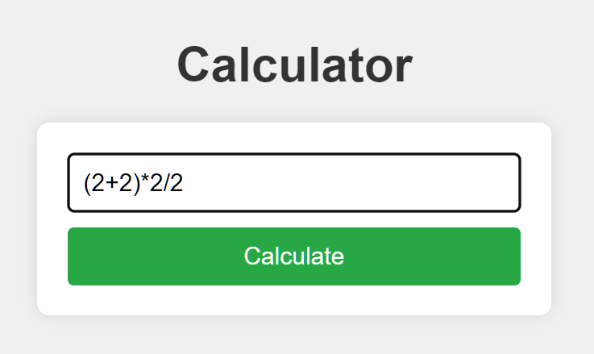

# Calculator Web Application

This is a simple web-based calculator application built using **Spring Boot**. It allows users to input a mathematical expression and get the evaluated result. The project serves as a demonstration of integrating Spring Boot with a third-party mathematical expression evaluation library (Exp4j). The application is styled using CSS for a clean and modern user interface.

## Project Overview

The calculator accepts user input in the form of a mathematical expression (such as `1+2`, `3*4`, etc.) and returns the evaluated result. If the input expression is invalid, an error message is displayed.

This project was based on the foundation of the **gs-spring-boot-docker** project from the Spring repository, which demonstrates how to containerize Spring Boot applications with Docker.

## Features

- Basic mathematical operations such as addition, subtraction, multiplication, and division.
- Error handling for invalid expressions.
- Styled user interface for better user experience.
- RESTful structure to handle requests and calculate results dynamically.

## Getting Started

### Prerequisites

To run this project, you will need the following:

- Java 17 or higher
- Maven or Gradle
- Docker (if you want to containerize the application)

### Running the Application

1. Clone the repository to your local machine:

    ```bash
    git clone https://github.com/yourusername/calculator-web-app.git
    cd calculator-web-app
    ```

2. Build and run the project using Maven:

    ```bash
    mvn spring-boot:run
    ```

3. Open a browser and navigate to `http://localhost:8080` to use the calculator.

## Project Structure

- `src/main/java/hello/Application.java`: Main Spring Boot application class.
- `src/main/resources/style.css`: CSS file for styling the calculator interface.
- `src/test/java/hello/CalculatorTest.java`: Unit tests for the calculator functionality.

## Testing

This project uses **JUnit** for unit testing. There are two tests:

- A passing test that checks the result of a simple expression (`1+1` should return `2`).
- A failing test that checks for an incorrect result (`5-1` should return `2`, which is incorrect and will fail the test).

To run the tests, use the following command:

```bash
mvn test
```

## Screenshots




## Technologies Used

- **Spring Boot**: A framework for building production-ready applications in Java.
- **Exp4j**: A lightweight Java library for evaluating mathematical expressions.
- **JUnit 5**: A testing framework for unit tests.

## Based on gs-spring-boot-docker

This project is built on top of the **gs-spring-boot-docker** guide from the official Spring repository, which demonstrates how to package Spring Boot applications into Docker containers. You can find the original guide [here](https://github.com/spring-guides/gs-spring-boot-docker).

## License

This project is licensed under the MIT License - see the [LICENSE](LICENSE.txt) file for details.

## Acknowledgments

- [Spring Guides](https://spring.io/guides)
- [Exp4j](http://www.objecthunter.net/exp4j/)
- [JUnit 5](https://junit.org/junit5/)
